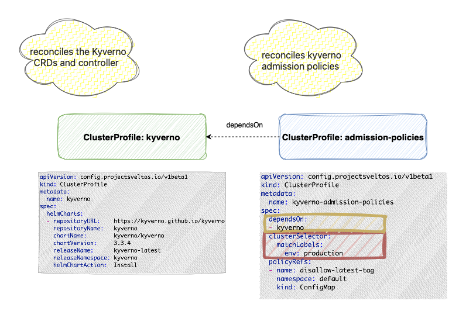
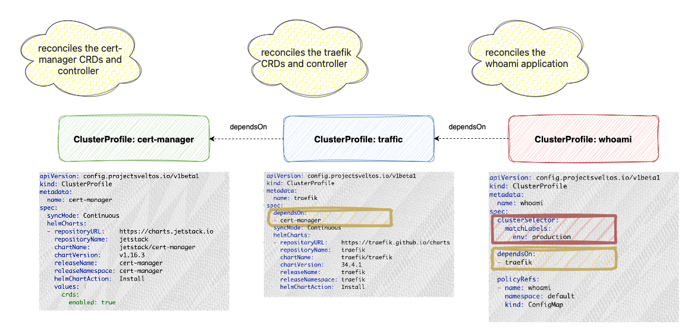
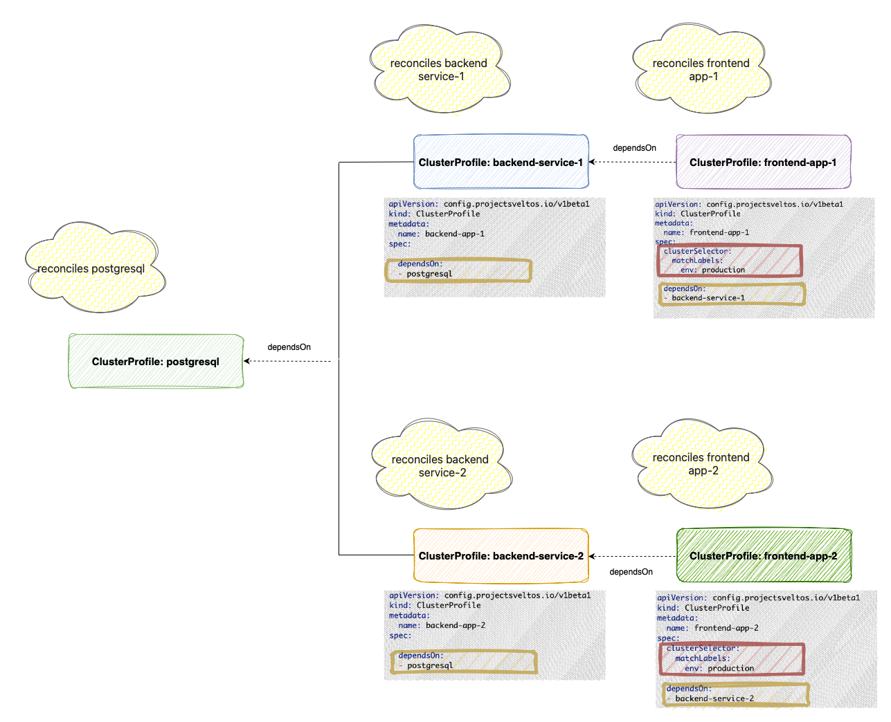

## Introduction to _dependsOn_

ClusterProfile instances can leverage other ClusterProfiles to establish a deployment order for add-ons and applications. The *dependsOn* fields enables the definition of prerequisite ClusterProfiles. Within any managed cluster that matches the current ClusterProfile, the deployment of different add-ons and applications will start once all add-ons and applications in the specified dependency ClusterProfiles have been successfully deployed.

### Example: Kyverno ClusterProfiles

The below examaple displays a ClusterProfile which encapsulates all Kyverno policies for a cluster and declares a ClusterProfile dependency named `kyverno`, which is responsible for installing the Kyverno Helm chart.

!!! example ""
    ```yaml
    ---
      apiVersion: config.projectsveltos.io/v1beta1
      kind: ClusterProfile
      metadata:
        name: kyverno-admission-policies
      spec:
        clusterSelector:
          matchLabels:
            env: production
        dependsOn:
        - kyverno
        policyRefs:
        - kind: ConfigMap
          name: disallow-latest-tag
          namespace: default
        - kind: ConfigMap
          name: restrict-wildcard-verbs
          namespace: default
    ```
[^1]

!!! example ""
    ```yaml
      ---
      apiVersion: config.projectsveltos.io/v1beta1
      kind: ClusterProfile
      metadata:
        name: kyverno
      spec:
        helmCharts:
        - chartName: kyverno/kyverno
          chartVersion: v3.3.3
          helmChartAction: Install
          releaseName: kyverno-latest
          releaseNamespace: kyverno
          repositoryName: kyverno
          repositoryURL: https://kyverno.github.io/kyverno/
    ```

Notice that the `kyverno` ClusterProfile lacks a **clusterSelector**, so it won't be deployed on its own. The `kyverno-admission-policies` ClusterProfile, however, has a **clusterSelector** targeting production clusters and a **dependsOn** field referencing kyverno. When this profile is created, Sveltos resolves its dependency. Any time a cluster matches the `kyverno-admission-policies` selector, Sveltos will first deploy the Kyverno Helm chart and then apply the admission policies.



### Example: Kyverno and Kubevela ClusterProfile

In the below YAML definitions, the ClusterProfile instance *cp-kubevela* relies on the ClusterProfile instance *cp-kyverno*. That means that the *cp-kyverno* ClusterProfile add-ons will get deployed to clusters matching the label set to `env=prod` and afterwards, the ClusterProfile `cp-kubevela` will take place.

!!! example ""
    ```yaml
    ---
    apiVersion: config.projectsveltos.io/v1beta1
    kind: ClusterProfile
    metadata:
      name: cp-kubevela
    spec:
      dependsOn:
      - cp-kyverno
      clusterSelector:
        matchLabels:
          env: production
      syncMode: Continuous
      helmCharts:
      - repositoryURL: https://kubevela.github.io/charts
        repositoryName: kubevela
        chartName: kubevela/vela-core
        chartVersion: 1.9.6
        releaseName: kubevela-core-latest
        releaseNamespace: vela-system
        helmChartAction: Install
    ```

!!! example ""
    ```yaml
    ---
    apiVersion: config.projectsveltos.io/v1beta1
    kind: ClusterProfile
    metadata:
      name: cp-kyverno
    spec:
      clusterSelector:
        matchLabels:
          env: production
      helmCharts:
      - repositoryURL:    https://kyverno.github.io/kyverno/
        repositoryName:   kyverno
        chartName:        kyverno/kyverno
        chartVersion:     v3.3.3
        releaseName:      kyverno-latest
        releaseNamespace: kyverno
        helmChartAction:  Install
    ```

The above example is equivalent of creating a single ClusterProfile.

!!! example ""
    ```yaml
    ---
    apiVersion: config.projectsveltos.io/v1beta1
    kind: ClusterProfile
    metadata:
      name: cp-kyverno
    spec:
      clusterSelector:
        matchLabels:
          env: prod
      helmCharts:
      - repositoryURL:    https://kyverno.github.io/kyverno/
        repositoryName:   kyverno
        chartName:        kyverno/kyverno
        chartVersion:     v3.3.3
        releaseName:      kyverno-latest
        releaseNamespace: kyverno
        helmChartAction:  Install
      - repositoryURL:    https://kubevela.github.io/charts
        repositoryName:   kubevela
        chartName:        kubevela/vela-core
        chartVersion:     1.9.6
        releaseName:      kubevela-core-latest
        releaseNamespace: vela-system
        helmChartAction:  Install
    ```

!!! note
    Separate ClusterProfiles promote better organization and maintainability, especially when different teams or individuals manage different ClusterProfiles.


## Recursive Resolution

One of the key strengths of Sveltos is its ability to handle complex dependency chains. Imagine an application `whoami` that relies on `Traefik`, which itself depends on `cert-manager`. With Sveltos, you only need to define the deployment of `whoami`. Sveltos will automatically resolve the entire dependency tree, ensuring `cert-manager` and `Traefik` are deployed in the correct order before `whoami` is deployed. This simplifies complex deployments by automating the resolution of multi-level dependencies.



## Dependency Deduplication

Sveltos efficiently manages shared dependencies by ensuring they are deployed only once per cluster, even when multiple profiles rely on them. This optimizes resource utilization and prevents redundant deployments. Crucially, Sveltos maintains a dependency as long as any profile requiring it is active on the cluster.



When `frontend-app-1` is deployed, Sveltos first deploys `postgresql` and then `backend-service-1`, resolving the dependency chain. Subsequently, when `frontend-app-2` is deployed to the same cluster, Sveltos recognizes that `postgresql` is already present and avoids redeploying it. If `frontend-app-1` is then removed, `backend-service-1` is also removed. However, `postgresql` persists because it remains a dependency of `frontend-app-2`. Finally, only when `frontend-app-2` is removed will Sveltos remove `backend-service-2` and `postgresql`, as they are no longer required by any active profile on the cluster.

👉 [Read more here:](https://github.com/gianlucam76/devops-tutorial/tree/main/application-dependencies)


[^1]: To create the ConfigMaps with Kyverno policies used in this example
```
$ wget https://raw.githubusercontent.com/kyverno/policies/main/best-practices/disallow-latest-tag/disallow-latest-tag.yaml

$ kubectl create configmap disallow-latest-tag --from-file disallow-latest-tag.yaml

$ wget https://raw.githubusercontent.com/kyverno/policies/main/other/res/restrict-wildcard-verbs/restrict-wildcard-verbs.yaml

$ kubectl create configmap restrict-wildcard-verbs --from-file restrict-wildcard-verbs.yaml
```
