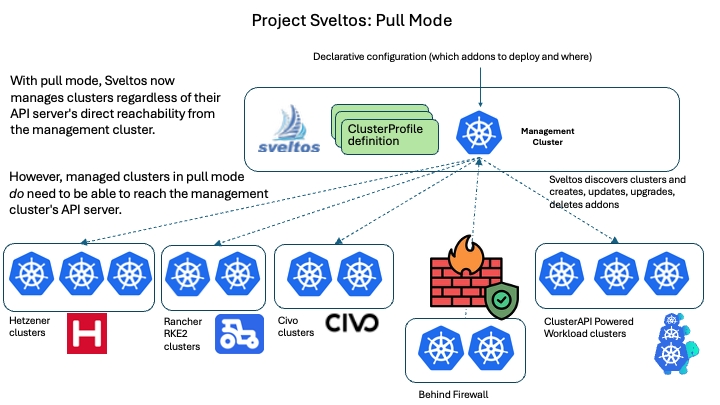

!!!video
    To learn more about the Sveltos **Pull Mode**, check out the [Youtube Video](https://www.youtube.com/watch?v=Y3dW5XYjg5I&amp;feature=youtu.be). If you find this valuable, we would be thrilled if you shared it! 😊


## Sveltos Cluster Registration Pull Mode

Sveltos supports managed cluster registration in **Pull Mode**. In this model, **managed** clusters actively **pull** configuration and add-ons from a central source, rather than having the management cluster push them directly to the managed clusters.

The **Pull Mode** is ideal for managed clusters behind a firewall, in air-gapped environments, edge deployments with limited bandwidth or highly regulated and secure setups.

If Sveltos is not already installed, have a look at the installation details located [here](../getting_started/install/install.md).

## How does it work?

While the core Sveltos controllers run in a **management** cluster and orchestrate deployments, the concept of **Pull Mode** becomes relevant when managing clusters in challenging network environments such as firewalled, air-gapped, or edge deployments, where direct inbound access from the management cluster to the managed clusters is either not possible or not desired.

This is how the **Pull Mode** flow works:

1. **Management Cluster**: It defines the desired state. We define our `ClusterProfile`/`Profile` resources in the management cluster, specifying which add-ons and configurations should be applied to which managed clusters by utilising the Kubernetes labels selection concept.
1. **Managed Cluster**: Rather than the management cluster initiating all deployments, a component on the managed cluster initiates a connection to the management cluster.
1. **Configuration Fetching**: The managed cluster pulls the relevant configuration, manifest, or Helm chart from the management cluster.
1. **Apply**: The managed cluster's local agent or component applies the pulled configurations to the cluster.



### Advantages

The following items are some of the benefits of utilising Sveltos in **Pull Mode**.

- **Firewalled and Air-Gapped Environments**: This is the primary driver. When managed clusters are behind firewalls or in air-gapped networks, direct inbound connections from a central management cluster are not possible. Sveltos in **Pull Mode** allows the managed clusters to reach out to the management cluster or a Git repository to obtain deployment instructions.
- **Edge Deployments**: For edge locations with intermittent connectivity or limited network bandwidth, the Sveltos **Pull Mode** offers resilience.
- **Security**: Reducing the need for inbound ports to managed clusters enhances the security posture of an environment by minimising the attack surface.

## Register Cluster

### sveltosctl Registration

It is recommended, but not required, to use the [sveltosctl](https://github.com/projectsveltos/sveltosctl "Sveltos CLI") for cluster registration. Alternatively, to **programmatically** register clusters, consult the [section](#programmatic-registration).

```bash
$ sveltosctl register cluster \
    --namespace=monitoring \
    --cluster=prod-cluster \
    --pullmode \
    --labels=environment=production,tier=backend \
    > sveltoscluster_registration.yaml
```

| Parameter        |    Description                                                                                                   |
|------------------|------------------------------------------------------------------------------------------------------------------|
| `--namespace`    |    The namespace in the **management** cluster where Sveltos stores information about the registered cluster.    |
| `--cluster`      |    The name of the cluster to identify the registered cluster within Sveltos.                                               |
| `--pullmode`     |    Enables the Sveltos **Pull Mode** registration.                                                                   |
| `--labels`       |    (Optional) Comma-separated key-value pairs to define labels for the registered cluster.                       |

Once the `.yaml` file is generated, apply it to the Kubernetes **managed** cluster.

```bash
$ export KUBECONFIG=</path/to/kubeconfig/managed/cluster>
$ kubectl apply -f sveltoscluster_registration.yaml
```

!!!note
    Test the **Pull Mode** with up to **two** managed clusters for free. Need more than two clusters? Contact us at `support@projectsveltos.io` to explore license options based on your needs!

### Programmatic Registration

To programmatically register clusters with Sveltos in **Pull Mode**, create the below resource and apply it to the **managed** cluster.

- **SveltosCluster**: Represent your cluster as an `SveltosCluster` instance.

!!! example "SveltosCluster"
    ```yaml hl_lines="2 4-5 9-10"
    ---
    apiVersion: lib.projectsveltos.io/v1beta1
    kind: SveltosCluster
    metadata:
      name: YOUR-CLUSTER-NAME
      namespace: YOUR-CLUSTER-NAMESPACE
      labels:
        environment: production
        tier: backend
    spec:
      pullMode: true
    ```
